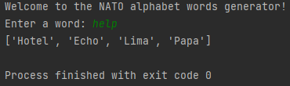

# NATO Phonetic Alphabet Generator

Ce projet Python utilise le module Pandas pour créer un générateur de mots en alphabet phonétique de l'OTAN. L'alphabet phonétique de l'OTAN est utilisé pour représenter chaque lettre de l'alphabet par un mot spécifique pour faciliter la communication, en particulier dans des environnements où la clarté est essentielle.

## Instructions

1. **Création d'un dictionnaire phonétique OTAN :** Le script commence par lire un fichier CSV, `nato_phonetic_alphabet.csv`, pour créer un dictionnaire en utilisant les colonnes "letter" et "code". Ce dictionnaire associe chaque lettre de l'alphabet à son mot phonétique OTAN correspondant.

2. **Génération de mots phonétiques :** Le script offre deux approches pour générer des mots phonétiques OTAN à partir d'un mot saisi par l'utilisateur. Les deux approches permettent de prendre en charge la saisie utilisateur, générer la liste de mots phonétiques et gérer les exceptions en cas de lettre invalide.

   - **Approche 1 (commentée) :** utilisation d'une boucle while avec la déclaration d'une variable not_all_letters qui est intialisée à True et qui prend la valeur de False lorsque l'utilisateur a bien renseigné des lettres: tant que l'utilisateur ne renseigne pas uniquement des lettres, l'exception KeyError est souvelée et la boucle continue d'être exécutée.
   - **Approche 2 (fonction `generate_phonetic`) :** utilisation d'une fonction generate_phonetic qui est appelée une première et qui est ensuite rappelée si l'exception KeyError est souvelevée.

## Exécution du Projet

1. Assurez-vous que Python est installé sur votre système.
2. Exécutez le script `nato_phonetic_generator.py`.
3. Suivez les instructions pour entrer un mot.
4. Le programme générera une liste de mots phonétiques correspondant à chaque lettre du mot saisi.

## Apperçu de l'interface

## Remarques

- Ce projet a été créé dans le cadre du cours [100 Days of Code: The Complete Python Pro Bootcamp](https://www.udemy.com/course/100-days-of-code/) d'Angela Yu sur la plateforme Udemy.
